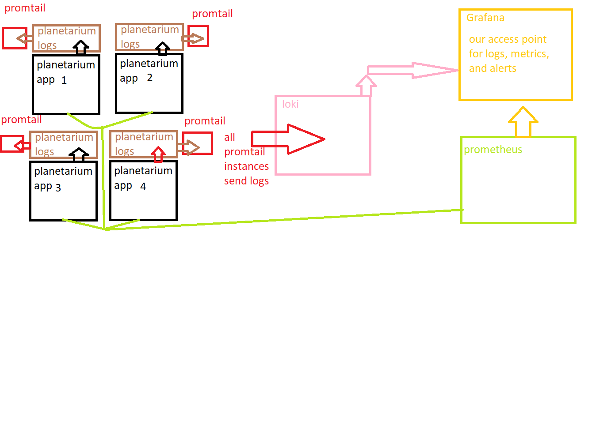

# SRE Review
You have an application and it is generating log files for you. This is a good starting point, but for any company or organization that wants to grow it is not enough: one instance of an application and the singular log file it creates is not enough to handle an expanding enterprise: you will need more instances of your app, and each of those instances will need to log its own issues/results. You COULD organize and parse through all the log files manually, but the more your company grows, the harder this activity becomes. You need a central location where all the log information can be stored and queried. This is where Loki comes in

# Loki
What is the problem?
- company/organization growth requires larger deployments, which means more logs will be created and more monitoring needs to happen
- manually looking through these log files (finding the right file, finding the right line of logs, and putting it in a readable format) is going to become more and more challenging as the companys grows until you reach a point where it is basically impossible to do on your own
- you need a central location where your logs can be stored and easily accessed

How is Loki the solution?
- Loki is a central source of Log information that organizes the logs via labels and provides a single point of reference to access ANY of the logs generated by our applications

We do have a slight problem though: Loki does not possess the ability on its own to get logs from our applications: we will need another tool to actually send the logs to Loki. This is where Promtail comes into play

# Promtail
What is the problem?
- we have multiple log sources that need to be sent to Loki, but Loki has no way of gathering these logs by itself
- the logs we need are in multiple locations making it unrealistic that a single tool by itslef (single instance) can handle gathering/sending the logs by itself

How is Promtail the solution?
- It is very easy to deploy Promtail as a "sidecar" with your main application
- each sidecar deployment watches its own log files, and when new ones are discovered due to Promtail "tailing" the logs, they are sent to a new location (in our case Loki)

We do have another slight problem: Promtail is sending our logs to Loki, but we don't have a tool to actually read the logs that are being stored in Loki. This is where Grafana comes into play

# Grafana solves the log problem
What is the problem?
- we currently have no way of reading the logs that are stored in loki
- to add to this, we don't have a good way once we get the logs to format them in such a way that we can easily understand their content

How is Grafana the solution?
- We can query the Loki database to find logs based on their labels
- Grafana gives the option to format the logs you see in such a way (such as breaking down json logs into their individual parts) that each piece of data is meaningful
    - a long error message can be displayed just like you would expect to see if you were seeing it in a development terminal, not on a single line

We do have another slight problem: with the current setup we are able to read logs from all our deployments, but we don't have a system in place to handle gathering metrics to determine our SLIs from our applications. This is where Prometheus comes into play

# Prometheus
What is the problem?
- in the same way that we had no tool to aggregate our logs, we have no tool currently to aggregate our application metrics to track our SLIs
- in the same way that we had no tool to handle getting logs from individual instances of our applications, we currently have no tool to get the individual metrics from our instances

How is Prometheus the solution?
- Prometheus is able to "scrape" our applications to gather relevant metrics
    - these metrics have to be exposed by the application: Prometheus can't make them up by itself
- Prometheus stores this information in a time-series database (timestamps are applied to the metrics so we can track them over time) which then allows us to not just see the metrics, but to track how they change (if they change) over time
- Prometheus also allows us to create alerts that can trigger or pend for a set time when metrics cross set thresholds (aka if latency is too high for 5 minutes an alert can trigger)
    - you can even set up alerts to trigger events like an email being sent, a pager being alerted, a slack channel recieving a message, etc.

We do have another slight problem: while Prometheus does technically allow us to visualize the information it scrapes, it does not provide an easy way to view all the relevant data we need at once. We can manually look up what we need, but once our deployment we are monitoring grows this becomes an untenable solution. We need a resource that will allow us to visualize all the data we need without us needing to manually query the information when we need it. This is where Grafana comes back into play

# Grafana solves the metrics problem
Grafana provides an means of looking at your metrics via dashboards, which are collections of graphs/visuals that show off your metrics as they are tracked over time. You can visualize metrics by creating your own dashboards, organizing them to view relavant metrics next to each other, and you can even see what alerts are triggered in your dashboards

# Basic Image
